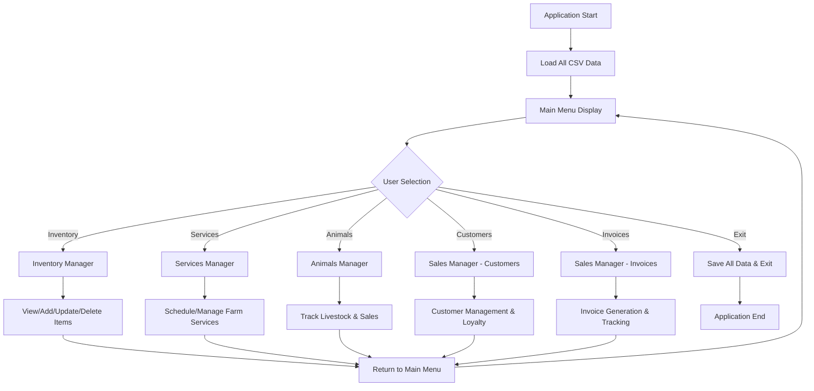

# Farm Life Inc. - Application Flow

## System Overview
```
┌─────────────────────────────────────────────────────────────┐
│                     Farm Life Inc.                          │
│                 Management System Flow                      │
└─────────────────────────────────────────────────────────────┘
```

## Main Application Flow



## Detailed Module Flow

### 1. Data Management Flow
```
Start Application
    ↓
Load Data from CSV Files:
├── inventory.csv    (Items, Cost, Sale Price, Quantity)
├── services.csv     (Service, Customer, Animal, Date, Time, Fee, Status)  
├── animals.csv      (Name, Species, Gender, Age, Value, Breeder)
├── customers.csv    (ID, Phone, Name, Email, Loyalty Points)
└── invoices.csv     (Invoice#, Customer ID, Date, Subtotal, Tax, Total)
    ↓
Present Main Menu
```

### 2. User Navigation Flow
```
Main Menu (GUI)
├── Logo & Farm Life Inc. Title
├── Select Option Prompt
└── Button Grid:
    ├── Row 1: [Inventory] [Services] [Animals]
    └── Row 2: [Customers] [Invoices] [Exit]
```

### 3. Module Interaction Flow
```
Each Manager Module:
    ↓
Menu Options (typically):
├── View All Records
├── Add New Record  
├── Update Existing
├── Delete Record
├── Search/Filter
├── Generate Reports
└── Return to Main Menu
    ↓
Auto-save to CSV
    ↓
Return to Main Menu
```

### 4. Data Flow Architecture
```
User Interface (Swing GUI)
    ↓
Main.java (Controller)
    ↓
Manager Classes:
├── InventoryManager.java
├── ServicesManager.java  
├── AnimalsManager.java
└── SalesManager.java
    ↓
Store Class (CSV Operations)
    ↓
File System (CSV Storage):
├── inventory.csv
├── services.csv
├── animals.csv
├── customers.csv
└── invoices.csv
```

## Key Features Flow

### Customer Management Flow
```
Customer Operations:
├── Search Customer (by name/phone/ID)
├── Browse All Customers (paginated for large datasets)  
├── Add New Customer (with validation)
├── Update Customer Info
├── Loyalty Points Tracking
└── Link to Invoice Generation
```

### Error Handling Flow
```
User Action
    ↓
Input Validation
    ↓
Error Detected? 
├── Yes → Show Error Dialog → Retry Input
└── No → Process Action → Success Message
    ↓
Auto-save Changes
    ↓
Continue Operations
```

### Application Lifecycle
```
1. Startup:
   - Initialize GUI components  
   - Load CSV data into memory
   - Create responsive logo
   - Display main menu

2. Runtime:
   - Handle user interactions
   - Validate all inputs
   - Update data in memory
   - Auto-save to CSV files
   - Provide user feedback

3. Shutdown:
   - Confirm exit intention
   - Save all modified data
   - Clean up resources
   - Exit gracefully
```

## Technical Architecture Notes

- **Data Storage**: CSV files with headers for human readability
- **GUI Framework**: Java Swing with custom responsive design
- **Error Handling**: Try-catch blocks with user-friendly error messages
- **Data Validation**: Input sanitization and type conversion safety
- **File Operations**: Header-aware CSV reading/writing with error recovery
- **User Experience**: Confirmation dialogs and search functionality

## Usage Patterns

1. **Daily Operations**: Quick access to inventory and customer management
2. **Service Scheduling**: Track farm services with date/time management  
3. **Sales Tracking**: Animal sales and invoice generation
4. **Customer Relations**: Loyalty program and contact management
5. **Reporting**: View summaries and track business metrics